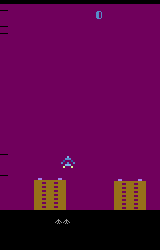
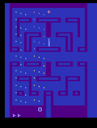

# Intrinsic Curiosity Module (ICM)

🚧👷🛑 Under Construction!!!

## Table of Contents

1. [Overview](#overview)
2. [Setup](#setup)
3. [Results](#results)
4. [Analysis](#analysis)

## Overview

Note to self: different values of T_MAX have a significant effect for different environments...  

This repository contains an implementation of the Intrinsic Curiosity Module (ICM) built upon an A3C (Asynchronous Advantage Actor-Critic) backend using PyTorch. The ICM encourages exploration by predicting an agent's next state given its current state and action, generating an intrinsic reward that complements extrinsic rewards from the environment. The algorithm is evaluated on various Atari environments using Gymnasium.

## Setup

### Required Dependencies

It's recommended to use a Conda environment to manage dependencies and avoid conflicts. You can create and activate a new Conda environment with the following commands:

```bash
conda create -n rl python=3.10
conda activate rl
```

After activating the environment, install the required dependencies using:

```bash
pip install -r requirements.txt
```

### Running the Algorithm

You can run the ICM-enhanced A3C algorithm on any supported Gymnasium Atari environment with a discrete action space using the following command:

```bash
python main.py --env 'MsPacmanNoFrameskip-v4'
```

- **Environment Selection**: Use `-e` or `--env` to specify the Gymnasium environment. The default is `None`, so you must specify an environment.
  
  Example:

  ```bash
  python main.py --env 'PongNoFrameskip-v4'
  ```

- **Number of Training Episodes**: Use `--n_games` to specify the number of games the agent should play during training.

  Example:

  ```bash
  python main.py --n_games 5000
  ```

- **Parallel Environments**: Use `--n_envs` to specify the number of parallel environments to run during training. The default is 4.

  Example:

  ```bash
  python main.py --env 'AsterixNoFrameskip-v4' --n_envs 16
  ```

Using a Conda environment along with these flexible command-line options will help you efficiently manage your dependencies and customize the training process for your specific needs.

## Results

<!-- 
<table>
    <tr>
        <td>
            <p><b>AirRaid</b></p>
            
        </td>
        <td>
            <p><b>Alien</b></p>
            
        </td>
        <td>
            <p><b>Amidar</b></p>
            
        </td>
    </tr>
    <tr>
        <td>
            
        </td>
        <td>
            
        </td>
        <td>
            
        </td>
    </tr>
</table>
-->

## Analysis

<!--
## Analysis of Results

This section will explore the performance of the ICM module across various Atari games, focusing on its ability to drive exploration in environments with sparse rewards. We will compare the performance of ICM-enhanced A3C with standard A3C to highlight the effectiveness of intrinsic rewards.
-->

## Acknowledgements

Shout out to Phil Tabor, an excellent teacher! I highly recommend his [Youtube channel](https://www.youtube.com/machinelearningwithphil).

Special thanks to Deepak Pathak and his team for their work. Check out the original paper and their project [here](https://pathak22.github.io/noreward-rl/).
